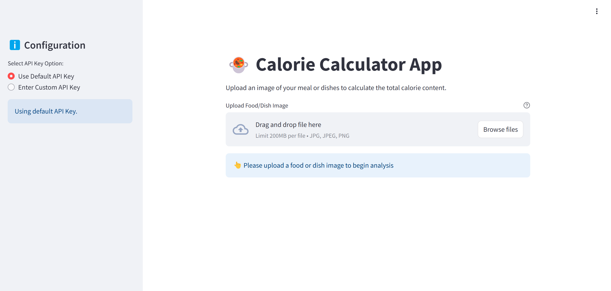

# 🍲 Calorie Calculator App 

Ever since I discovered that the Gemini 2.0 multimodal LLM is freely available for a limited time, I was eager to explore its potential. With the new year offering a fresh start, I decided to create a simple yet impactful app that calculates calorie intake from a picture of food. I'm thrilled to announce that my **Calorie Calculator App** is now live and successfully deployed on **Azure Cloud** using **Docker** and **Azure App Service**!

---

## 🌐 Deployed Application

Try it live here: [Calorie Calculator App](https://caloriecalculatorv1.azurewebsites.net/)

---

## 🌟 Key Features

1. **Dish Identification**:
   - Upload a food or dish image, and the app will identify each dish.
   - Provides a brief description of each identified dish.

2. **Calorie Estimation**:
   - Searches the web (via DuckDuckGo) to fetch typical calorie values per serving for each dish.
   - Displays calorie information along with references to the sources.

3. **Total Calorie Calculation**:
   - Computes and displays the total calorie content of the entire meal.

4. **Dietary Suggestions**:
   - Offers personalized health-conscious dietary tips and alternatives.

5. **User-Friendly Interface**:
   - Built with **Streamlit** for a sleek and intuitive user experience.

6. **Customizable API Keys**:
   - Users can configure a custom Google API key for enhanced security.

---

## 🚀 Technology Stack

- **AI Models**: Gemini 2.0 multimodal LLM
- **Web Scraping**: DuckDuckGo integration for calorie data retrieval
- **Image Processing**: Pillow library
- **Frontend**: Streamlit
- **Deployment**: Dockerized app hosted on Azure App Service

---

## 📚 How It Works

1. **Upload an Image**:
   - Simply upload a picture of your meal (JPG, JPEG, or PNG format).

2. **Analyze the Meal**:
   - The app identifies the dishes, queries the web for calorie information, and computes the total calorie count.

3. **Results and Suggestions**:
   - View a structured response with:
     - Identified dishes and descriptions
     - Calorie content per dish with reference links
     - Total calories
     - Healthy dietary tips or alternatives

---

## 🚀 Future Enhancements

- Integration with more robust AI models for accurate food and calorie detection.
- Addition of multi-lingual support for global accessibility.
- Real-time calorie tracking and meal planning features.

---

Enjoy exploring your meals in a whole new way with the **Calorie Calculator App**! Feedback and suggestions are always welcome. 😊
